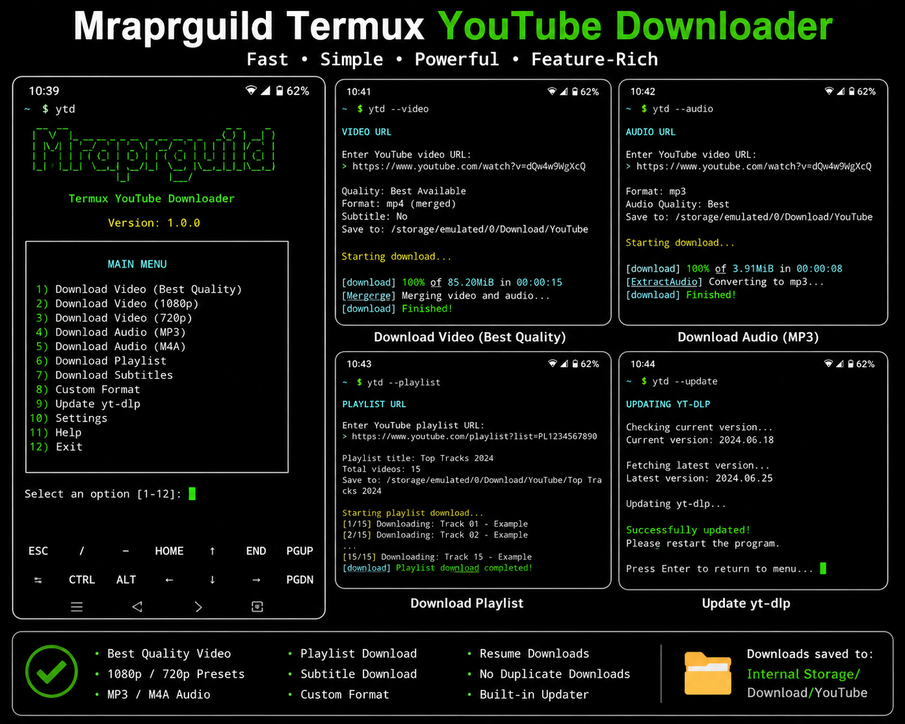

<div align="center">


<br>


</div>

---

## 📱 Screenshot

<div align="center">



</div>

---

## ✨ Features

<table>
<tr>
<td width="50%">

### 🎬 Video Downloads

- Best available video quality
- Automatic video and audio merging
- 1080p download preset
- 720p download preset
- MP4 output support
- Interrupted-download resume

</td>
<td width="50%">

### 🎵 Audio Downloads

- MP3 audio extraction
- M4A audio extraction
- Best available audio quality
- Embedded metadata
- Thumbnail embedding
- Separate music directory

</td>
</tr>
<tr>
<td width="50%">

### 📚 Playlist Tools

- Complete playlist downloads
- Numbered playlist filenames
- Automatic playlist folders
- Duplicate-download protection
- Continue failed downloads
- Organized output structure

</td>
<td width="50%">

### 🛠 Advanced Tools

- Subtitle downloading
- Automatic subtitle support
- Available-format listing
- Custom format selection
- Built-in yt-dlp updater
- Interactive and CLI modes

</td>
</tr>
</table>

---

## 🖥 Terminal Preview

```text
=============================================
  Mraprguild Termux YouTube Downloader v1.0.0
=============================================

1.  Best quality video
2.  Video up to 1080p
3.  Video up to 720p
4.  MP3 audio
5.  M4A audio
6.  Download playlist
7.  Download subtitles
8.  List available formats
9.  Custom format download
10. Update yt-dlp
11. Open download folder
0.  Exit

Select an option:
```

---

## 🚀 Installation

### Step 1 — Update Termux

```bash
pkg update -y && pkg upgrade -y
```

### Step 2 — Installation

Copy and Paste Code 

```bash
git clone https://github.com/Mraprguild/Termux-Youtube-Downloader.git
cd termux-os

```

### Step 3 — Run the installer

```bash
chmod +x install.sh ytd.sh uninstall.sh
./install.sh
```

Allow Android storage permission when Termux requests it.

### Step 4 — Launch

```bash
ytd
```

---

## ⚡ Direct Commands

```bash
# Open interactive menu
ytd

# Download best-quality video
ytd --video "YOUTUBE_URL"

# Download MP3 audio
ytd --audio "YOUTUBE_URL"

# Download a playlist
ytd --playlist "PLAYLIST_URL"

# Update yt-dlp
ytd --update

# Display help
ytd --help
```

---

## 📂 Download Location

```text
Internal Storage/Download/YouTube
```

Generated folders may include:

```text
YouTube/
├── Music/
├── Playlists/
├── Subtitles/
└── downloaded-video.mp4
```

---

## 🔧 Requirements

The installer automatically installs:

| Package | Purpose |
|---|---|
| Python | Runs yt-dlp |
| pip | Installs and updates yt-dlp |
| yt-dlp | Downloads supported media |
| FFmpeg | Merges video/audio and converts formats |
| Deno | JavaScript runtime used for YouTube extraction |
| curl | Network utility |

---

<details>
<summary><b>🧰 Troubleshooting commands</b></summary>

<br>

Update the downloader engine:

```bash
ytd --update
```

Check installed versions:

```bash
yt-dlp --version
ffmpeg -version
deno --version
python --version
```

List available formats:

```bash
yt-dlp -F "YOUTUBE_URL"
```

Reinstall yt-dlp:

```bash
python -m pip install --upgrade "yt-dlp[default]"
```

Repair storage access:

```bash
termux-setup-storage
```

</details>

<details>
<summary><b>🗑 Uninstall</b></summary>

<br>

Run:

```bash
./uninstall.sh
```

The application files and the `ytd` command will be removed. Previously downloaded videos and audio files will remain in internal storage.

</details>

---

## 🔐 Responsible Use

Download only media that you own, that is in the public domain, or that you have permission to save. Respect copyright, platform terms, privacy, and local law.

---

## 👨‍💻 Author

<div align="center">

### Mraprguild

[](https://github.com/Mraprguild)

Project built for Termux users who want a simple menu-driven yt-dlp experience.

</div>

---

## 📄 License

Released under the [MIT License](LICENSE).

<div align="center">


**Made with ❤️ by Mraprguild**

</div>
